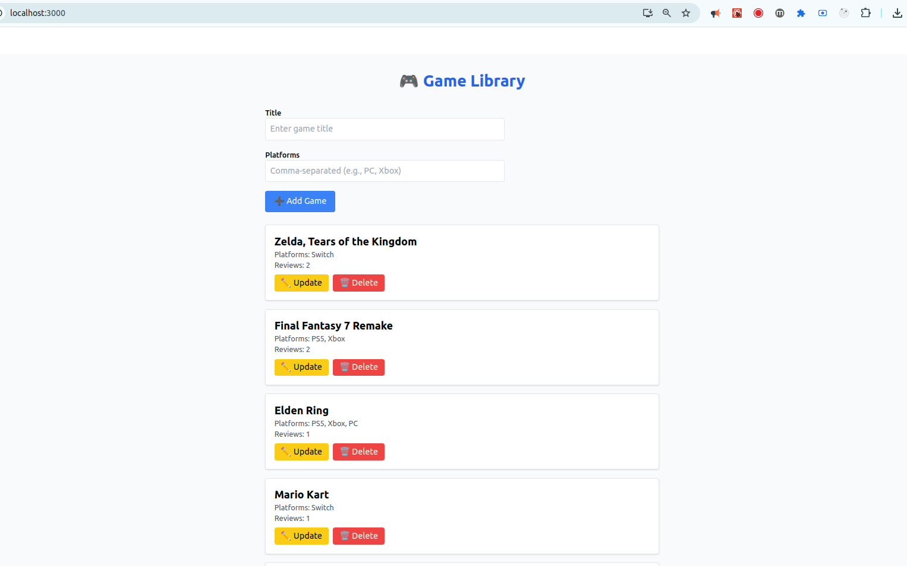

# 🔥 Full Stack Game Library (GraphQL + React + Apollo + PostgreSQL)

This is a full-stack game library web application built with **React (frontend)** and **Node.js/Apollo Server (backend)**, showcasing **GraphQL** queries/mutations, **i18n** translations, and a **PostgreSQL** database with **Knex/Objection** ORM.

---

## 🔐 Features

- ✅ **GraphQL API**: Queries and mutations for games, reviews, authors  
- ✅ **React + Apollo Client** on the frontend with cache updates  
- ✅ **i18n** support (English & French) via [react-i18next]  
- ✅ **CRUD** operations: Add, Update, Delete games (cache-driven)  
- ✅ **PostgreSQL** integration with Knex migrations and seeds  
- ✅ **Objection.js** models and relations for Games, Reviews, Authors  
- ✅ **Docker-friendly** setup (optional)  
- ✅ Responsive UI with Tailwind CSS  

---

## 📸 Preview



🎥 [Demo Video](/demo.mp4)

---

## 🛠️ Tech Stack

| Layer     | Stack                                           |
|-----------|-------------------------------------------------|
| Frontend  | React, TypeScript, Apollo Client, react-i18next |
| Backend   | Node.js, Apollo Server, Knex, Objection, pg     |
| Database  | PostgreSQL                                      |
| Auth & i18n| N/A (public demo)                              |

---

## 🚀 Getting Started

```bash
# Clone the repo
git clone https://github.com/yourusername/game-library-graphql.git
cd game-library-graphql

# Backend
cd back-end
npm install
# configure .env or update knexfile.js with your DB credentials
npx knex migrate:latest --esm
npx knex seed:run --esm
npm start

# Frontend
cd ../front-end
npm install
npm start
```

- Frontend runs at: http://localhost:3000  
- Backend runs at: http://localhost:4000/graphql  

---

## 📝 Project Structure

```
.
├── back-end
│   ├── migrations/
│   ├── seeds/
│   ├── src/
│   │   ├── graphql/
│   │   │   ├── schema.js
│   │   │   └── resolvers.js
│   │   ├── models/
│   │   │   ├── Game.js
│   │   │   ├── Review.js
│   │   │   └── Author.js
│   │   └── index.js
│   └── knexfile.js
└── front-end
    ├── public/
    ├── src/
    │   ├── components/
    │   ├── graphql/
    │   ├── i18n.ts
    │   └── pages/
    └── package.json
```

---

## 🔗 Links

- 🎥 [Watch the demo](./demo.gif)

<video controls width="100%">
  <source src="./demo.mp4" type="video/mp4" />
  Your browser doesn’t support embedded video.
</video>

- 📄 [MIT License](./LICENSE)


---

*Created by hugo machefer*